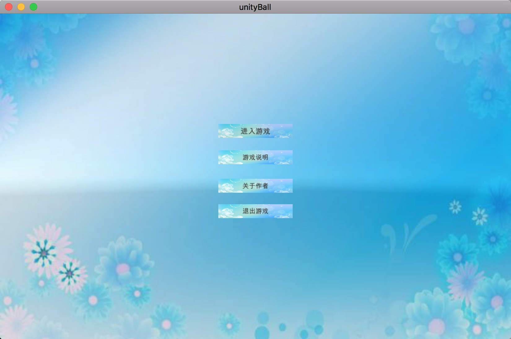
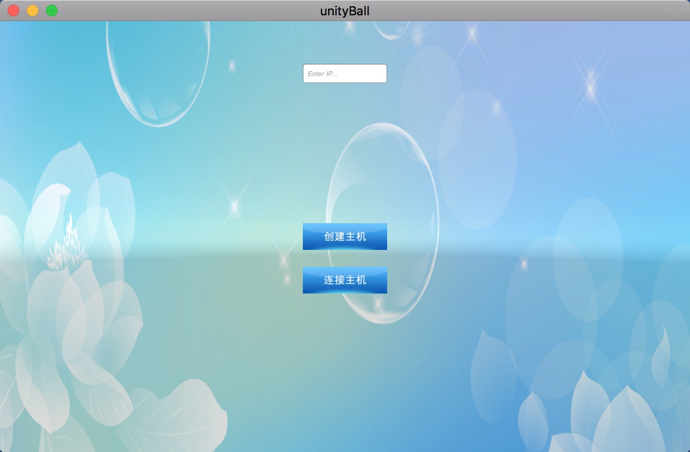
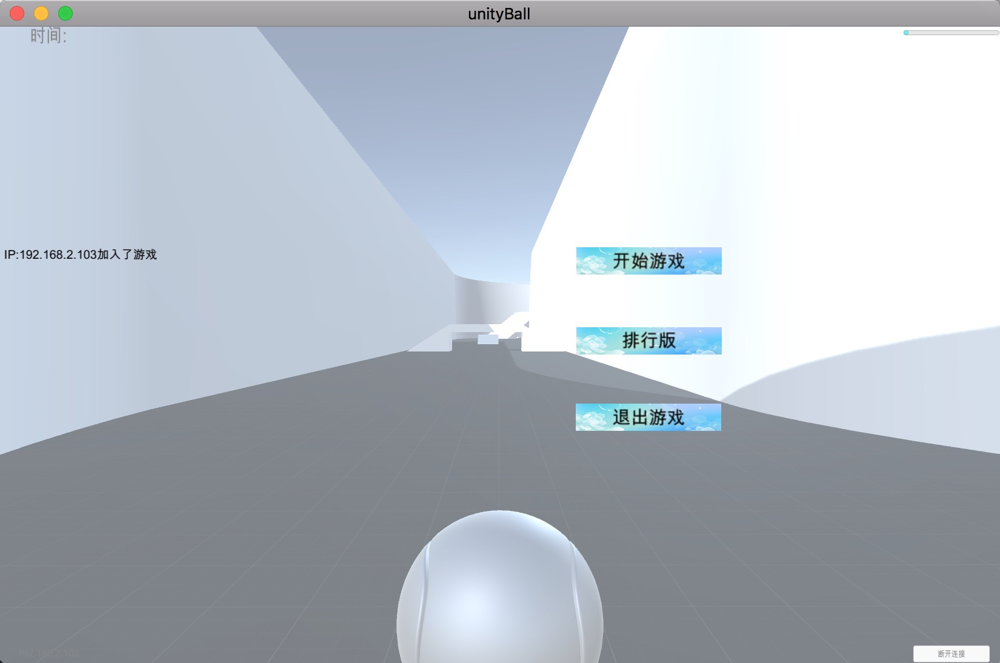
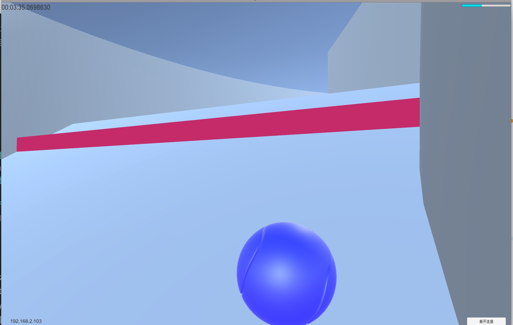
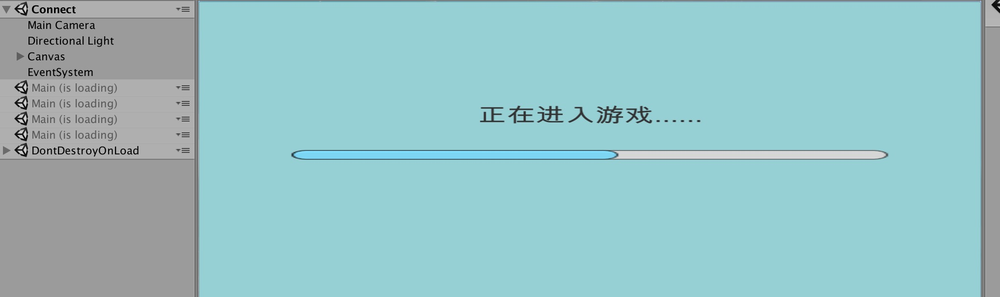
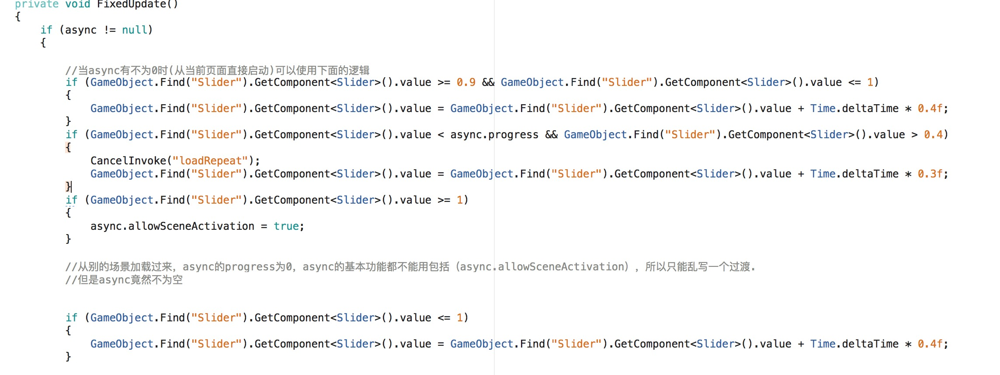

# Summary
----
Unity3D(C#)
--------------
> 用到的技术
>> `NetworkManager` `UGUI` `Animator`等等
##### 实现局域网联机的一个小球游戏

### 运行环境
`Mac Unity3D2017.2个人版`，`Windows Unity3D2017.2个人版`
### 开发环境
`Mac Unity3D2017.2个人版`，`Windows Unity3D2017.2个人版`，`Visual Studio2017（Unity自带）`

#### Download
<pre><code>git clone git@github.com:TypeInfos/OnlineBall.git</pre></code>
_下载完，解压OnlineBall，用Unity打开，然后Buid And Run_
#### 三个场景
##### 开始场景（第一层）

##### 连接游戏场景（连接主机或创建主机）

##### 正式开始游戏场景（游戏运行场景）

##### 联机效果(电脑有点卡，分开运行比较流畅，我还开了unity)

##### 游戏过程

##### 到终点后

**当有多个人加入游戏时，第一个人到达终点时，所以玩家的屏幕会出现10秒倒计时，在这10秒内到达终点才会出现名次和用时，也可以提交分数到本地的data.bin，生成排行版，否则会出现会完成**

这个小游戏最主要的就是*NetworkManager*
**这里说下我自己的理解：**

1. 如果是服务端
if (isServer) { }
2. 如果是客户端
if (isClient) { }
3. 如果是本地角色
if (isLocalPlayer) { }
4. 如果不是本地角色输入
if (!isLocalPlayer) return;

*客户端与服务端相互通知*

1. [ClientRpc] 从服务端通知客户端 在客户端调用方法 方法名以 Rpc 开头
[ClientRpc]
private void RpcReset() { }
用法：一般这个函数在Command里面执行，小球吃到金币变颜色，就要放在ClientRpc里面执行，告诉别的客户端这个球变颜色了。
 
2. Cmd 开头
[Command]
void CmdShoot() { }
从客户端通知服务端，在服务端运行方法
用法：一般用于卵生预设体，和执行ClientRpc函数，修改同步变量

3. [SyncVar]设置客户的的数据hp与服务端的数据hp同步
[SyncVar(hook ="Onchange")] 当服务端的数据hp发生变化时 在客户端调用名为Onchange方法
[SyncVar(hook ="Onchange")]
public float hp;
void Onchange(float heslth)
{
healthSlider.value = heslth / maxHp;
}
同步变量([SyncVar])必须要在服务端执行，所以前面要加if(isserver)，因为服务端的权限最大（主机才是老大）

4. NetworkServer.Spawn(bullet);
还得将bullet（prefab）放入NetworkMangaer的registered Spawnable Prefabs，意思就是说只要这些都是可卵生的预设体
将服务端创建的物体(子弹)同步到客户端
NetworkServer.Spawn(bu);

##### 异步加载，UI过渡，让玩家感觉不到卡顿

_直接从Connect运行，优化后的过渡动画是可以用的，async的属性（progress，allowSceneActivation）都可以用
但从别的场景加载到Connect时，async的属性不能用，很神奇的一点是async不为null，但是其他属性都不能用，估计是场景加载的机制问题，我不知道为什么，所以优化过的过渡动画就被我注视掉，当前的过渡很僵硬。_

## Finally
大三上的期末作业，虽然时间很短，但是收获颇多，喜欢的可以clone，大部分代码还可以优化.

